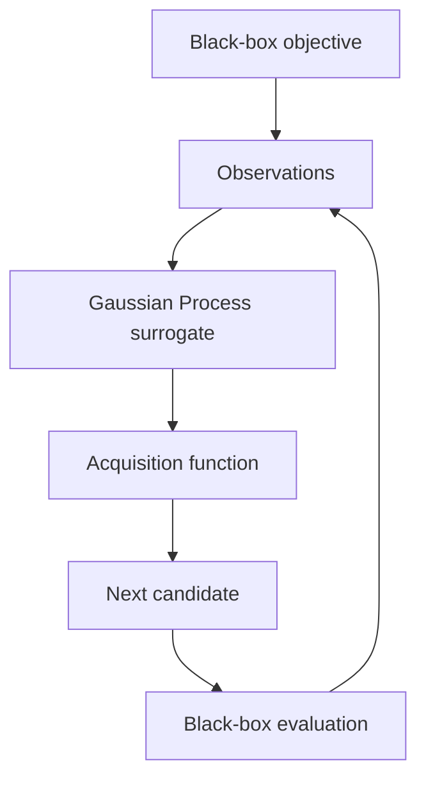

# BayesOpt-X

BayesOpt-X is a Python library for Bayesian Optimization of expensive black-box functions.

A black-box function is one you can evaluate, but whose internals you cannot use. There is no gradient, no closed form, and often no cheap way to call it again. Grid search wastes those calls. This project spends them where a model says improvement is still plausible.

## How it works

**Bayesian Optimization** keeps a cheap stand-in for the true objective and uses that stand-in to choose the next evaluation.

The stand-in here is a **Gaussian Process (GP)**. After each observation the GP returns, at every candidate `x`:

- a **mean** `μ(x)` — the current guess for `f(x)`
- a **standard deviation** `σ(x)` — how uncertain that guess is

Points far from data have high `σ(x)`. That uncertainty is what drives exploration.

An **acquisition function** turns `μ` and `σ` into a score. The optimizer evaluates the true function at a high-scoring point, then updates the GP.

Two scores are implemented (both written for maximization; if you minimize, observations are negated first):

| Acquisition | What it does |
| --- | --- |
| **Expected Improvement (EI)** | Expected amount by which `x` would beat the best value so far. `xi` adds a little extra exploration. |
| **Upper Confidence Bound (UCB)** | `μ(x) + β σ(x)`. Larger `β` prefers uncertain regions. |

**Exploitation** follows `μ(x)`. **Exploration** follows `σ(x)`. EI and UCB mix those two motives differently. Neither is always better.

Random Search samples the box uniformly. It is the baseline used in the experiments, not a claim that Bayesian Optimization always wins.

## Features

- Sphere, Rosenbrock, and Rastrigin test functions
- scikit-learn Gaussian Process with a Matern kernel (`ν = 2.5`), input/output standardization, and predictive uncertainty
- Expected Improvement and Upper Confidence Bound
- Minimization and maximization
- Next-point search by random multi-start L-BFGS-B inside the bounds
- Random Search baseline
- Input validation and `logging`
- Reproducible runs via `random_state` (`optimize()` resets state first)
- pytest suite and GitHub Actions (Python 3.11, Ruff, pytest)
- CLI experiment scripts that write CSV files and plots

There is no web UI and no Docker setup.

## Architecture



The optimizer fits the GP on the points evaluated so far, maximizes EI or UCB inside the search box, evaluates the true objective at that candidate, and appends the result to the dataset.

## Project structure

```
bayesopt-x/
├── src/
│   ├── black_box.py       # Sphere, Rosenbrock, Rastrigin
│   ├── validation.py      # shared input checks
│   ├── gp_model.py        # Gaussian Process surrogate
│   ├── acquisition.py     # EI and UCB
│   ├── optimizer.py       # Bayesian Optimization loop
│   └── random_search.py   # uniform random baseline
├── experiments/
│   ├── config.py
│   ├── cli.py
│   ├── runners.py
│   ├── plotting.py
│   ├── benchmark.py
│   ├── compare.py
│   ├── multi_benchmark.py
│   ├── benchmark_suite.py
│   ├── compare_acquisitions.py
│   └── plot_results.py
├── tests/
├── results/               # CSV summaries and plots
├── notebooks/
├── pyproject.toml
├── requirements.txt
├── README.md
└── .github/workflows/tests.yml
```

## Installation

Python 3.11 or newer.

```bash
python -m venv .venv
.venv\Scripts\activate          # Windows
# source .venv/bin/activate     # macOS / Linux
pip install -r requirements.txt
```

Pinned packages: `numpy==2.4.6`, `scipy==1.17.1`, `scikit-learn==1.9.1`, `pandas==3.0.5`, `matplotlib==3.11.1`, `pytest==9.1.1`.

## Usage

```python
import numpy as np
from src.black_box import sphere
from src.optimizer import BayesianOptimizer
from src.random_search import RandomSearch

bounds = np.array([
    [-5.0, 5.0],
    [-5.0, 5.0],
])

opt = BayesianOptimizer(
    objective=sphere,
    bounds=bounds,
    acquisition="ei",  # or "ucb"
    minimize=True,
    random_state=42,
)
best_x, best_y = opt.optimize(n_initial=5, n_iterations=20)

rs = RandomSearch(sphere, bounds, minimize=True, random_state=42)
rs_x, rs_y = rs.optimize(n_iterations=25)
```

Library code logs through the standard `logging` module. Experiment scripts print summaries to stdout.

## Running tests

```bash
pytest -v
```

GitHub Actions (`.github/workflows/tests.yml`) installs `requirements.txt`, runs `ruff check src experiments tests`, then `pytest -v` on Python 3.11.

## Running experiments

Run these from the repository root.

```bash
python -m experiments.benchmark_suite
python -m experiments.compare_acquisitions
python -m experiments.plot_results
python -m experiments.benchmark
python -m experiments.compare
python -m experiments.multi_benchmark
```

Scripts that use the shared optimizer CLI accept:

| Flag | Meaning | Default |
| --- | --- | --- |
| `--n-initial` | Random initial evaluations for BO | `5` |
| `--n-iterations` | BO steps after initialization | `20` |
| `--seed` | Single-run seed | `42` |
| `--seeds` | Multi-run seeds | `42 7 21 100 2026` |
| `--benchmark` | `sphere`, `rosenbrock`, `rastrigin`, or `all` | `all` |
| `--acquisition` | `ei` or `ucb` | `ei` |
| `--output-dir` | CSV directory | `results/` |

`plot_results` is different. It only accepts `--results-dir` and `--plots-dir`.

A few flags are parsed but not used by every script:

- `benchmark.py` and `compare.py` always run 1-D Sphere. They honor `--seed`, `--n-initial`, `--n-iterations`, and `--acquisition`.
- `compare_acquisitions.py` always runs EI, UCB, and Random Search. `--acquisition` does not change that.
- `benchmark_suite.py` and `multi_benchmark.py` honor `--benchmark` and `--acquisition`.

Random Search is given `n_initial + n_iterations` evaluations so the budget matches BO.

## Results

Numbers below are the **mean best objective** from the CSV files already in `results/`. Protocol for those files: 2-D Sphere / Rosenbrock / Rastrigin, seeds `42, 7, 21, 100, 2026`, 5 initial points plus 20 BO steps (25 evaluations). Lower is better.

Bayesian Optimization is **not** guaranteed to outperform Random Search. The useful method depends on the landscape, dimension, budget, kernel, acquisition, and seed. On Rosenbrock, seed `100`, Random Search beat Expected Improvement; seed `42` was a tie.

From `results/benchmark_summary.csv` (BO used EI):

| Benchmark | Bayesian Optimization (EI) | Random Search |
| --- | ---: | ---: |
| Sphere | 0.00097065 | 1.65567 |
| Rosenbrock | 0.47342 | 7.08387 |
| Rastrigin | 5.20510 | 9.28453 |

From `results/acquisition_summary.csv`:

| Benchmark | Expected Improvement | UCB | Random Search |
| --- | ---: | ---: | ---: |
| Sphere | 0.00097065 | 0.00003760 | 1.65567 |
| Rosenbrock | 0.47342 | 0.37978 | 7.08387 |
| Rastrigin | 5.20510 | 8.36882 | 9.28453 |

Plots from those CSVs are in `results/plots/`.

## Limitations

- Gaussian Process fitting grows roughly as `O(n³)` in the number of observations. This code is for small budgets, not thousands of points.
- Acquisition maximization is random multi-start L-BFGS-B. It can miss the global acquisition maximum, especially as dimension grows.
- The published experiments are synthetic and 1-D or 2-D.
- `alpha` on the GP is numerical jitter, not a model of noisy observations.
- sklearn may emit `ConvergenceWarning` when kernel hyperparameters sit on their bounds. Those warnings are not filtered.
- There is no parallel / batch suggestion step.

## Future improvements

- Additional kernels
- An explicit noise model
- Parallel Bayesian Optimization
- Higher-dimensional and constrained problems
- Stronger global acquisition optimization

## License

## License

This project is licensed under the MIT License. See the [LICENSE](LICENSE) file for details.
